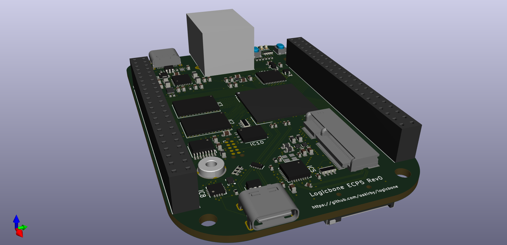
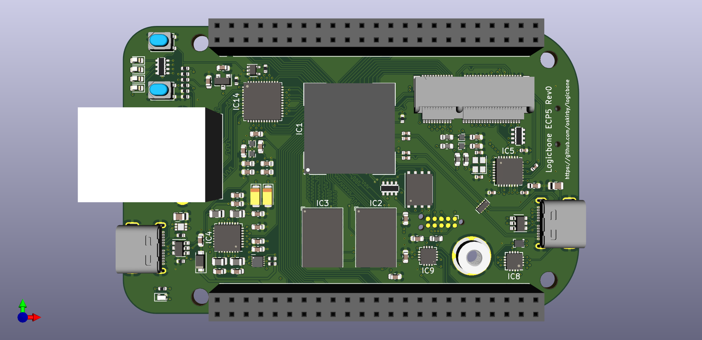
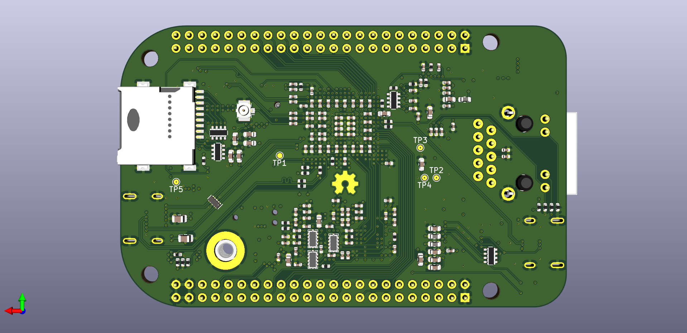

LogicBone
=========

When you can't quite find the development board you want, why not make your own?

This project aims to design a feature rich FPGA development board that is
compatible with the open source FPGA synthesis tools such as [yosys](http://www.clifford.at/yosys/),
[NextPNR](https://github.com/YosysHQ/nextpnr) and [SymbiFlow](https://github.com/SymbiFlow),
while also targeting larger logic designs that need faster IO. The
requirements set out for this board are, in order of priority:
 * Compatiblity with open-source FPGA synthesis tools.
 * Minimum of 4Gb of high speed memory, preferably at least 8Gb.
 * At least one Ethernet interface.
 * Compatiblity with existing expansion interfaces.
 * USB interface for programming, debug and power.
 * Licenseable as Open Source Hardware.

The ultimate objective of this board is to instantiate a soft core processor, such as
the RISC-V, and use it to boot a Linux operating system with networking.

To that effect, this board is designed to be mechanically and electrically compatible
with the Beaglebone Black, but featureing a Lattice ECP5 FPGA, which is available in
logic sizes up to 85k LUTs, and a selection of hardware blocks for DDR3 DQS acceleration,
MIPI interfaces, DSPs and 3Gbps SERDES.

Features
--------

The major features of this board include:
 * Lattice ECP5 (LFE5UM-85-8BG381)
   - 84k LUTs and 669 kbits of distributed RAM 
   - 3744 kbits of embedded block RAM
   - 205 IO pins
   - 156 hardware multipliers
   - 4 PLLs
   - 2 dual channel 3Gbps SERDES
 * Beaglebone Black mechanical and header compatibility.
   - P9 is fully supported via the FPGA.
   - 12-bit 1MSPS muxed ADC for the analog pins.
   - P8 supports up to 16 high speed LVDS pairs.
 * 8Gb on-board DDR3L RAM
 * KSZ9031 Gigabit Ethernet PHY.
 * microSD card slot.
 * USB-C upstream facing port for power and programming.
 * M.2 E-Keyed expansion interface:
   - Accepts connectivity options in the 2230 form factor.
   - Both PCIe lanes are routed to the FPGA SERDES.
   - GPIO, UART, SDIO and PCM interfaces.
 * MaxLinear MXL7704 power manager.
 * STM32L452 to provide programming and debug interfaces.

Work In Progress
----------------
This project is still in the PCB layout phase, and changes are still being
made to the design as issues are identified and resolved. In the meantime,
we have a [schematic](logicbone.pdf) and some renders of the board that
might satisfy your curiosity.

We would be happy to accept any feedback and review on the design that you
might be willing to provide.

Copyright
---------
Copyright Owen Kirby 2020

This documentation describes Open Hardware and is licensed under the
CERN OHL v1.2.

You may redistribute and modify this documentation under the terms of
the CERN OHL v1.2. (see [LICENSE.txt](LICENSE.txt)). This documentation
is distributed WITHOUT ANY EXPRESS OR IMPLIED WARRANTY, INCLUDING OF
MERCHANTABILITY, SATISFACTORY QUALITY AND FITNESS FOR A PARTICULAR
PURPOSE. Please see the CERN OHL v.1.2 for applicable conditions.
